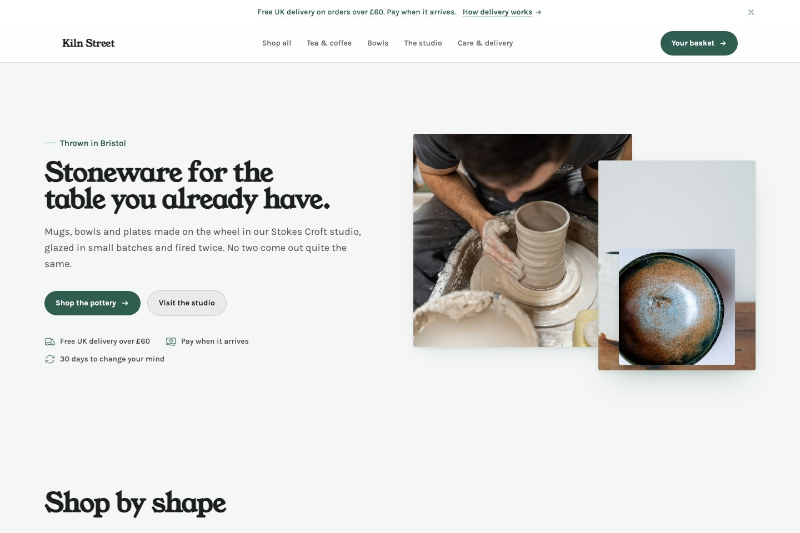
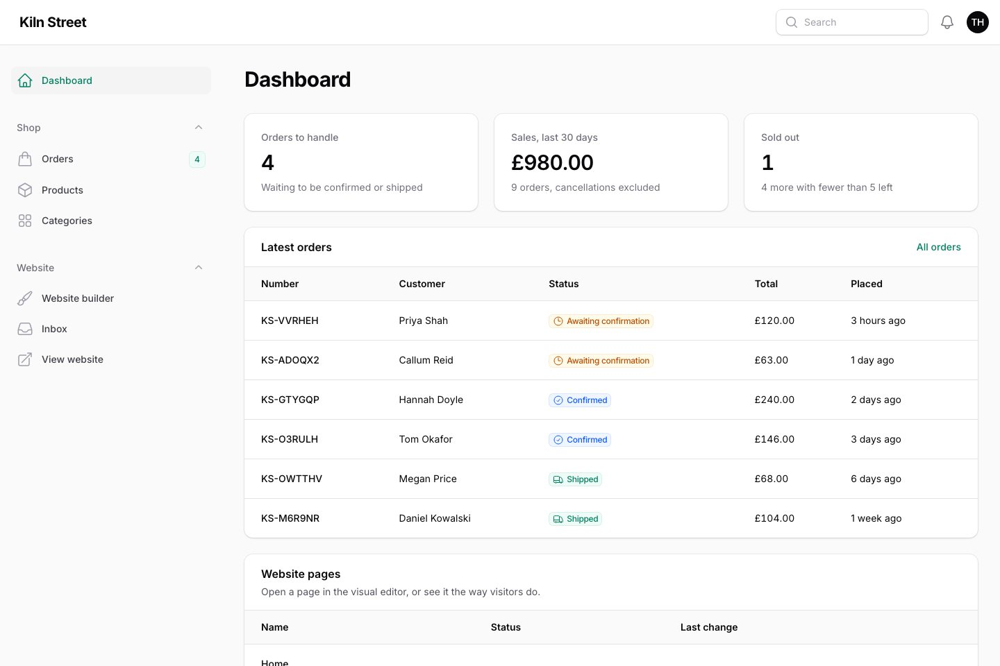

# FilamentCraft store starter

A Laravel shop with a finished storefront, a catalog you manage in Filament and orders that
arrive by email and in the panel.



The shop is Kiln Street, a pottery in Bristol that does not exist. It comes with 19 products
in four categories, ten sample orders, a basket and a cash-on-delivery checkout, seven
storefront pages and the photographs to go with them. Replace the pots with what you sell and
it is your shop.

Built on Laravel 13, Filament 5 and [FilamentCraft](https://filamentcraft.dev).

## Before you start

- PHP 8.3 or newer and Composer 2. No Node, no build step.
- A FilamentCraft license. The package is installed from a private Composer registry, and
  setup asks for the email you bought it with and your license key.
  [Get a license](https://filamentcraft.dev/pricing).

## Install

```bash
git clone https://github.com/filamentcraft/starter-store my-shop
cd my-shop
composer setup
```

`composer setup` checks your license against `packages.filamentcraft.dev`, installs the
dependencies, creates a SQLite database, seeds the catalog and the storefront and prints where
to sign in. It is safe to run again.

Then start the server:

```bash
composer dev
```

Open http://localhost:8000 for the shop and http://localhost:8000/admin for the panel.
Sign in as `admin@example.com` with the password `password`, and change both.

With [Laravel Herd](https://herd.laravel.com), skip `composer dev`: run `herd link` in the
project and set `APP_URL=http://my-shop.test` in `.env`.

<details>
<summary>Installing without a prompt (CI, Docker, servers)</summary>

Setup reads the credentials from any of these, in order, and never asks:

1. `COMPOSER_AUTH` with an `http-basic` entry for `packages.filamentcraft.dev`
2. an `auth.json` next to `composer.json`
3. your global Composer credentials
   (`composer config --global http-basic.packages.filamentcraft.dev you@example.com KEY`)
4. `FILAMENTCRAFT_EMAIL` and `FILAMENTCRAFT_KEY`

</details>

## Running the shop



The dashboard shows what needs doing: orders waiting to be confirmed or shipped, the last 30
days of sales and anything sold out or running low.

- **Orders** are created by the checkout, never by hand. Open one to confirm it, mark it shipped
  and then delivered. Cancelling puts the items back into stock. Every new order sends the
  customer a confirmation email and drops a notification into the panel's bell.
- **Products** hold the price, stock, photos, options (sizes, glazes) and a table of details
  shown on the product page. Drag rows to change the order they appear in the shop.
- **Categories** group products and become filters and tiles on the storefront.
- **Website builder** edits the storefront pages: the homepage, the shop, the product page
  template, basket, checkout, and the two content pages.

Payment is cash on delivery, so there is nothing to configure to take a test order. Delivery
is £5, free over £60; both are settings on the basket and checkout sections in the editor.

To send the emails, configure `MAIL_*` in `.env`. Until then they go to the log.

## Where things live

| Path | What it is |
|---|---|
| `app/Models`, `app/Models/Builders` | Products, categories, orders, and the query scopes for each |
| `app/Storefront/CatalogStorefront.php` | What the storefront sections read products from and send orders to |
| `app/Actions` | Placing an order and changing its status, including the stock moves |
| `app/Filament` | The panel: resources, dashboard widgets, the money input |
| `app/Blueprints` | The storefront as first seeded: pages, header, footer, colors, fonts |
| `database/seeders/CatalogSeeder.php` | The 19 products and their photos |
| `config/store.php` | Currency and the order number prefix |
| `bin/license` | The license check that runs before `composer install` |

## Making it yours

- **Your products.** Delete the pots in the panel and add your own, or edit
  `CatalogSeeder` and run `php artisan migrate:fresh --seed`. That wipes the database,
  including orders and editor changes.
- **Currency.** Set `STORE_CURRENCY`, `STORE_CURRENCY_SYMBOL` and `STORE_ORDER_PREFIX` in
  `.env`. Prices are stored in minor units, so £12.50 is `1250`.
- **Look.** Colors and fonts are under the gear icon in the editor's left rail, or in
  `KilnStreetSite::siteSettings()` if you would rather seed them.
- **Payment.** Checkout is cash on delivery. To take cards, create the order in
  `CatalogStorefront::placeOrder()` as pending and hand the customer to your payment
  provider before confirming it.

## Going live

- Set `APP_URL` to the real domain. Links, the sitemap and social cards are built from it.
- Give the server your registry credentials through `COMPOSER_AUTH`, or on Laravel Forge under
  **Site → Settings → Composer**.
- Add `php artisan filamentcraft:upgrade` to your deploy script after `migrate`.
- Configure a real mailer so order confirmations reach customers.
- `php artisan filamentcraft:doctor` checks the install and tells you how to fix what it finds.

## Tests

```bash
composer test
```

Runs Pint, PHPStan at level 6 and the Pest suite, which walks a basket through checkout and
checks the order, the stock and the emails. The GitHub workflow does the same; add
`FILAMENTCRAFT_EMAIL` and `FILAMENTCRAFT_KEY` as repository secrets so it can install the
package.

## The other starter kits

- [starter-site](https://github.com/filamentcraft/starter-site): a company website with a
  contact form, no shop.
- [starter-multistore](https://github.com/filamentcraft/starter-multistore): a platform where
  every merchant gets their own store.

## License

The code in this repository is MIT licensed. FilamentCraft itself is commercial software.
Photographs are from Unsplash; see [CREDITS.md](CREDITS.md).
